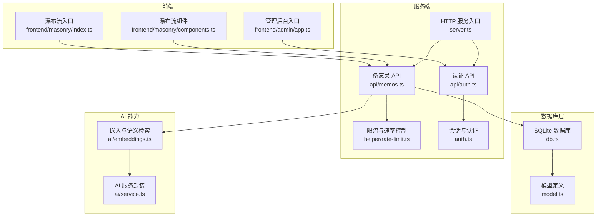
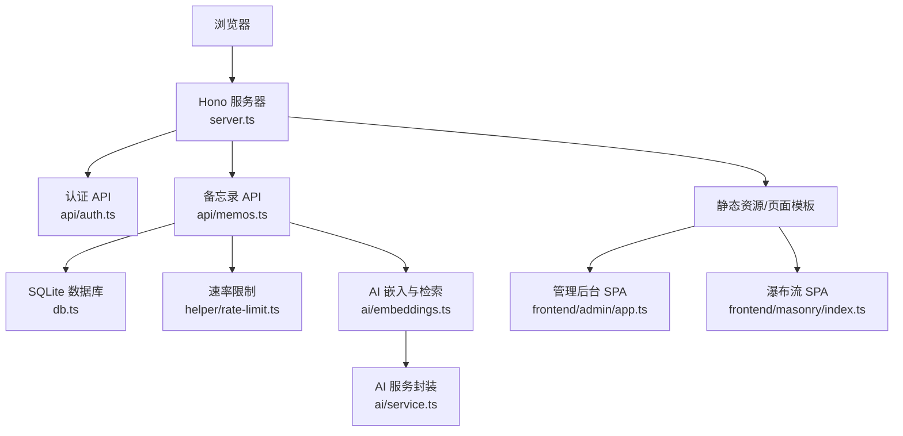
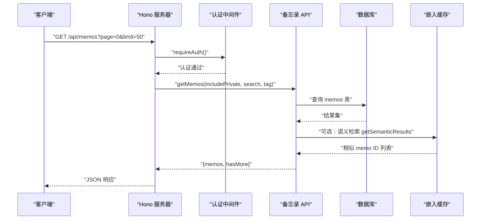
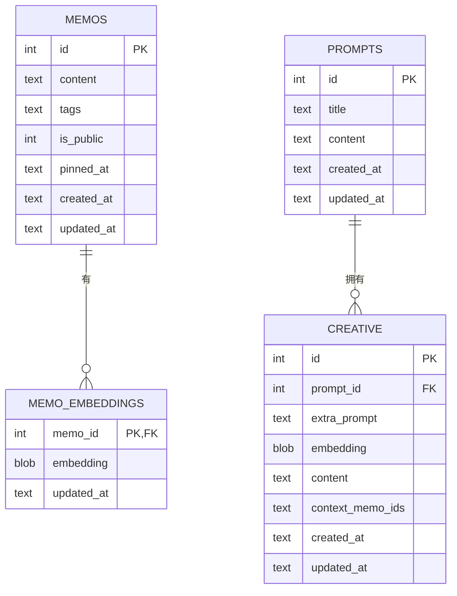
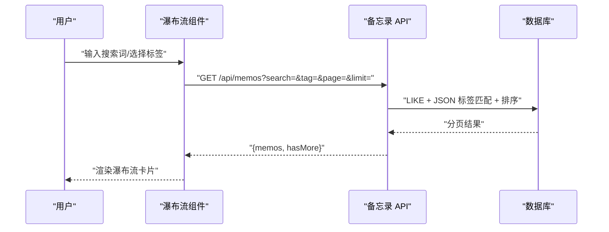
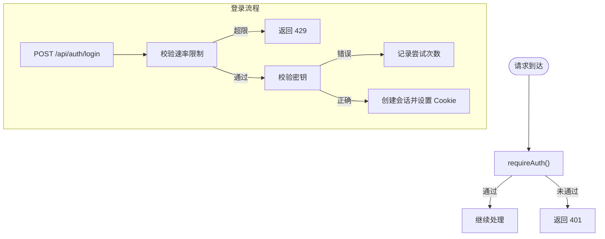
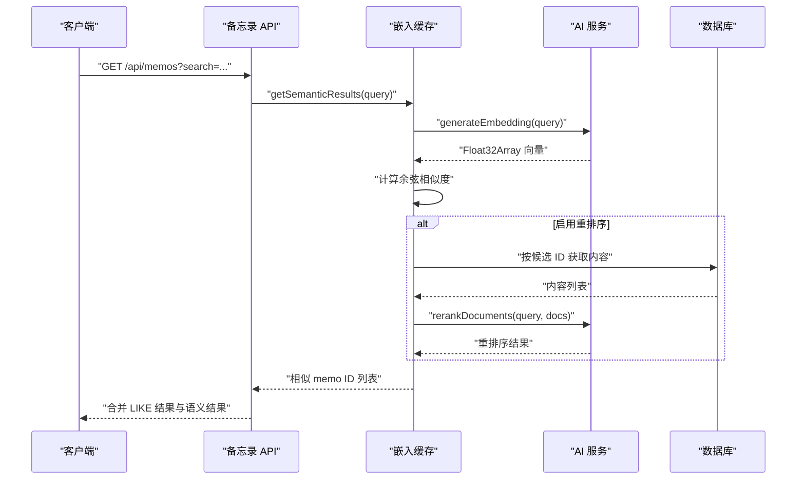
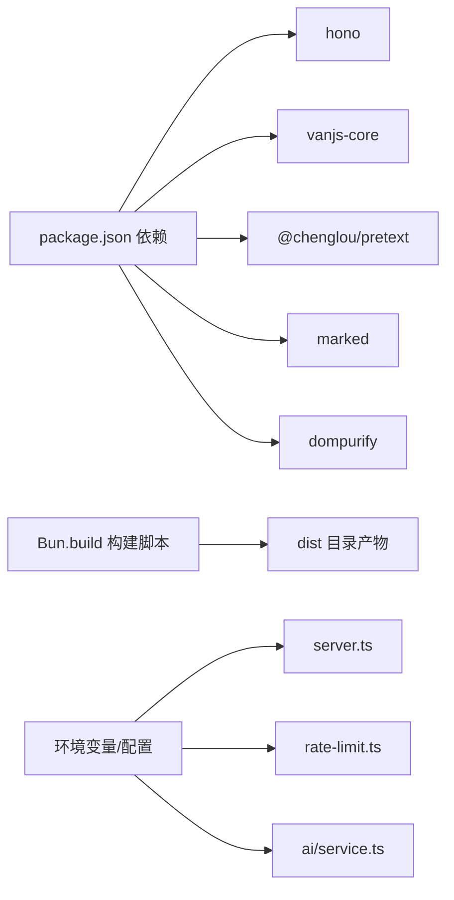

# 架构概览

<cite>
**本文引用的文件**
- [README.md](file://README.md)
- [package.json](file://package.json)
- [src/server.ts](file://src/server.ts)
- [src/db.ts](file://src/db.ts)
- [src/model.ts](file://src/model.ts)
- [src/api/memos.ts](file://src/api/memos.ts)
- [src/api/auth.ts](file://src/api/auth.ts)
- [src/auth.ts](file://src/auth.ts)
- [src/helper/rate-limit.ts](file://src/helper/rate-limit.ts)
- [src/frontend/admin/app.ts](file://src/frontend/admin/app.ts)
- [src/frontend/masonry/index.ts](file://src/frontend/masonry/index.ts)
- [src/frontend/masonry/components.ts](file://src/frontend/masonry/components.ts)
- [src/ai/service.ts](file://src/ai/service.ts)
- [src/ai/embeddings.ts](file://src/ai/embeddings.ts)
- [src/init/seed.ts](file://src/init/seed.ts)
</cite>

## 目录
1. [简介](#简介)
2. [项目结构](#项目结构)
3. [核心组件](#核心组件)
4. [架构总览](#架构总览)
5. [详细组件分析](#详细组件分析)
6. [依赖分析](#依赖分析)
7. [性能考量](#性能考量)
8. [故障排查指南](#故障排查指南)
9. [结论](#结论)
10. [附录](#附录)

## 简介
Memos 是一个基于 Bun 运行时的轻量级备忘录系统，采用前后端分离的三层架构：前端（瀑布流页面与管理后台）、服务端（Hono HTTP 服务与业务 API）、数据库层（SQLite，WAL 模式）。系统提供公开/私密备忘录管理、标签分类、全文搜索、瀑布流展示以及独立的管理员 SPA 界面。后端通过 Hono 提供 REST 风格 API，前端使用 VanJS 构建响应式组件，数据库采用 SQLite 并结合嵌入向量与重排序实现语义检索。

## 项目结构
项目采用按功能域划分的目录组织方式，核心入口与分层如下：
- 服务端入口与路由：src/server.ts
- 数据库层：src/db.ts
- 模型定义：src/model.ts
- API 子应用：src/api/*
- 认证与限流：src/auth.ts、src/helper/rate-limit.ts
- 前端（瀑布流）：src/frontend/masonry/*
- 前端（管理后台）：src/frontend/admin/*
- AI 能力：src/ai/*
- 初始化种子数据：src/init/seed.ts

**图表来源**
- [src/server.ts:1-125](file://src/server.ts#L1-L125)
- [src/api/memos.ts:1-220](file://src/api/memos.ts#L1-L220)
- [src/api/auth.ts:1-77](file://src/api/auth.ts#L1-L77)
- [src/db.ts:1-484](file://src/db.ts#L1-L484)
- [src/model.ts:1-35](file://src/model.ts#L1-L35)
- [src/helper/rate-limit.ts:1-153](file://src/helper/rate-limit.ts#L1-L153)
- [src/auth.ts:1-128](file://src/auth.ts#L1-L128)
- [src/ai/service.ts:1-507](file://src/ai/service.ts#L1-L507)
- [src/ai/embeddings.ts:1-228](file://src/ai/embeddings.ts#L1-L228)
- [src/frontend/masonry/index.ts:1-23](file://src/frontend/masonry/index.ts#L1-L23)
- [src/frontend/masonry/components.ts:1-337](file://src/frontend/masonry/components.ts#L1-L337)
- [src/frontend/admin/app.ts:1-251](file://src/frontend/admin/app.ts#L1-L251)

**章节来源**
- [README.md:25-45](file://README.md#L25-L45)
- [package.json:1-26](file://package.json#L1-L26)

## 核心组件
- 服务器端（Hono）：负责路由注册、静态资源服务、页面模板注入、子应用挂载与服务器启动。
- 数据库层（SQLite/WAL）：提供备忘录、提示词、创意内容与嵌入向量的持久化存储，支持 JSON 列与索引优化。
- 认证与会话：基于 Cookie 的内存会话与 Bearer Token 支持，配合登录频率限制。
- 速率限制：基于 IP 的小时/天双窗口计数，支持备忘录创建与 AI 调用两类。
- 前端瀑布流：VanJS 响应式组件，瀑布流布局、无限滚动、搜索与标签筛选、相似内容查找。
- 管理后台：VanJS SPA，密钥登录、备忘录 CRUD、置顶、导入导出、AI 工具箱。
- AI 能力：多提供商聊天与 DashScope 嵌入，支持语义检索与重排序。

**章节来源**
- [src/server.ts:38-125](file://src/server.ts#L38-L125)
- [src/db.ts:15-61](file://src/db.ts#L15-L61)
- [src/api/auth.ts:29-77](file://src/api/auth.ts#L29-L77)
- [src/auth.ts:28-128](file://src/auth.ts#L28-L128)
- [src/helper/rate-limit.ts:77-153](file://src/helper/rate-limit.ts#L77-L153)
- [src/frontend/masonry/index.ts:1-23](file://src/frontend/masonry/index.ts#L1-L23)
- [src/frontend/masonry/components.ts:1-337](file://src/frontend/masonry/components.ts#L1-L337)
- [src/frontend/admin/app.ts:1-251](file://src/frontend/admin/app.ts#L1-L251)
- [src/ai/service.ts:1-507](file://src/ai/service.ts#L1-L507)
- [src/ai/embeddings.ts:1-228](file://src/ai/embeddings.ts#L1-L228)

## 架构总览
系统采用“前端 SPA + Hono 后端 + SQLite 数据库”的三层架构，数据流从浏览器请求进入 Hono，经由认证与限流校验后访问数据库或 AI 服务，再返回 JSON 或静态页面。瀑布流页面与管理后台分别通过独立入口与构建产物提供。

**图表来源**
- [src/server.ts:38-125](file://src/server.ts#L38-L125)
- [src/api/memos.ts:1-220](file://src/api/memos.ts#L1-L220)
- [src/api/auth.ts:1-77](file://src/api/auth.ts#L1-L77)
- [src/db.ts:15-61](file://src/db.ts#L15-L61)
- [src/helper/rate-limit.ts:1-153](file://src/helper/rate-limit.ts#L1-L153)
- [src/ai/embeddings.ts:1-228](file://src/ai/embeddings.ts#L1-L228)
- [src/ai/service.ts:1-507](file://src/ai/service.ts#L1-L507)
- [src/frontend/admin/app.ts:1-251](file://src/frontend/admin/app.ts#L1-L251)
- [src/frontend/masonry/index.ts:1-23](file://src/frontend/masonry/index.ts#L1-L23)

## 详细组件分析

### 服务器端架构（Hono）
- 路由设计：通过 app.route 将认证、备忘录、AI、创意与导出导入等子应用挂载至 /api/* 路径；静态资源与页面模板通过 get 方法提供，支持 /favicon.svg、/index.js、/admin/app.js 与 HTML 模板。
- 中间件机制：认证中间件支持 Cookie 会话与 Bearer Token；速率限制中间件用于 API 调用节流。
- 静态文件服务：通过 Bun.file 提供静态资源，HTML 注入 base 标签以保证深层路径下的资源解析。
- 深度链接与回退：notFound 对 /admin/* 路径进行 SPA 回退，确保前端路由可用。
- 初始化流程：启动时初始化数据库、种子数据与嵌入缓存。

**图表来源**
- [src/server.ts:38-125](file://src/server.ts#L38-L125)
- [src/api/memos.ts:28-70](file://src/api/memos.ts#L28-L70)
- [src/db.ts:122-169](file://src/db.ts#L122-L169)
- [src/ai/embeddings.ts:95-154](file://src/ai/embeddings.ts#L95-L154)

**章节来源**
- [src/server.ts:38-125](file://src/server.ts#L38-L125)
- [src/api/memos.ts:1-220](file://src/api/memos.ts#L1-L220)
- [src/auth.ts:123-128](file://src/auth.ts#L123-L128)
- [src/helper/rate-limit.ts:77-153](file://src/helper/rate-limit.ts#L77-L153)

### 数据库层设计（SQLite/WAL）
- 初始化与模式：首次启动自动创建 memos、memo_embeddings、prompts、creative 表，并启用 WAL 与外键约束。
- 索引策略：对 pinned_at 建立索引，便于置顶排序；标签使用 JSON 列并支持 EXISTS + json_each 查询。
- 数据访问模式：提供 getMemos、getAllTags、countMemos、CRUD 与导入导出辅助方法；支持按 ID 列表批量查询与分页。
- 嵌入向量：保存 memo_id → 向量的映射，支持加载、更新与删除；提供相似度计算与重排序能力。

**图表来源**
- [src/db.ts:18-60](file://src/db.ts#L18-L60)
- [src/model.ts:1-35](file://src/model.ts#L1-L35)

**章节来源**
- [src/db.ts:15-61](file://src/db.ts#L15-L61)
- [src/db.ts:122-169](file://src/db.ts#L122-L169)
- [src/db.ts:253-276](file://src/db.ts#L253-L276)
- [src/db.ts:279-337](file://src/db.ts#L279-L337)
- [src/db.ts:339-403](file://src/db.ts#L339-L403)

### 前端架构（瀑布流与管理后台）
- 瀑布流页面：VanJS 组件驱动，支持搜索栏、标签选择、无限滚动、相似内容弹窗、复制文本与只读更多。
- 管理后台：VanJS SPA，密钥登录、侧边时间线、表单模态框、导入导出模态框、AI 工具箱集成。
- 组件化开发：通过状态对象与响应式绑定实现 UI 与数据解耦，事件处理集中在组件内部。

**图表来源**
- [src/frontend/masonry/components.ts:1-337](file://src/frontend/masonry/components.ts#L1-L337)
- [src/frontend/masonry/index.ts:1-23](file://src/frontend/masonry/index.ts#L1-L23)
- [src/api/memos.ts:28-70](file://src/api/memos.ts#L28-L70)
- [src/db.ts:122-169](file://src/db.ts#L122-L169)

**章节来源**
- [src/frontend/masonry/components.ts:1-337](file://src/frontend/masonry/components.ts#L1-L337)
- [src/frontend/admin/app.ts:1-251](file://src/frontend/admin/app.ts#L1-L251)

### 认证与安全
- 会话与 Cookie：基于内存集合维护会话，设置 HttpOnly、SameSite=Strict 的 Cookie；支持 Bearer Token 认证。
- 登录保护：登录接口支持速率限制，超过阈值进行冷却；生产环境强制要求设置密钥。
- 中间件：requireAuth 与 authMiddleware 统一处理认证失败与放行逻辑。

**图表来源**
- [src/auth.ts:28-128](file://src/auth.ts#L28-L128)
- [src/api/auth.ts:36-77](file://src/api/auth.ts#L36-L77)

**章节来源**
- [src/auth.ts:1-128](file://src/auth.ts#L1-L128)
- [src/api/auth.ts:1-77](file://src/api/auth.ts#L1-L77)

### AI 能力与语义检索
- 多提供商聊天：统一 OpenAI 兼容格式，支持流式与非流式响应。
- 嵌入向量：DashScope 文本嵌入，生成固定维度向量并缓存于内存，持久化至 SQLite。
- 语义检索：余弦相似度打分，支持候选集重排序（DashScope qwen3-rerank），最终返回相似备忘录 ID 列表。

**图表来源**
- [src/ai/embeddings.ts:95-154](file://src/ai/embeddings.ts#L95-L154)
- [src/ai/service.ts:351-385](file://src/ai/service.ts#L351-L385)
- [src/ai/service.ts:389-445](file://src/ai/service.ts#L389-L445)
- [src/db.ts:253-276](file://src/db.ts#L253-L276)

**章节来源**
- [src/ai/embeddings.ts:1-228](file://src/ai/embeddings.ts#L1-L228)
- [src/ai/service.ts:1-507](file://src/ai/service.ts#L1-L507)

## 依赖分析
- 运行时与框架：Bun、Hono、VanJS、@chenglou/pretext、marked、dompurify。
- 构建与打包：Bun.build 生成瀑布流与管理后台的 ES Module 打包，运行时按需编译。
- 环境变量：PORT、MEMOS_SECRET_KEY、AI 与速率限制配置通过 app.config.json 与环境变量覆盖。

**图表来源**
- [package.json:19-26](file://package.json#L19-L26)
- [src/server.ts:11-125](file://src/server.ts#L11-L125)
- [src/helper/rate-limit.ts:27-39](file://src/helper/rate-limit.ts#L27-L39)
- [src/ai/service.ts:19-75](file://src/ai/service.ts#L19-L75)

**章节来源**
- [package.json:1-26](file://package.json#L1-26)
- [src/server.ts:11-125](file://src/server.ts#L11-L125)
- [src/helper/rate-limit.ts:27-39](file://src/helper/rate-limit.ts#L27-L39)
- [src/ai/service.ts:19-75](file://src/ai/service.ts#L19-L75)

## 性能考量
- 缓存策略：嵌入向量缓存于内存，启动时从数据库加载并异步补全缺失项；删除/更新备忘录时同步清理缓存。
- 并发处理：Hono 基于 Bun 的高性能网络栈；前端瀑布流采用虚拟滚动与懒加载，减少 DOM 渲染压力。
- 资源优化：静态资源与页面模板按需提供，HTML 注入 base 标签避免深层路径资源解析问题；构建产物按浏览器模块格式输出。
- 速率限制：双窗口（小时/天）限流，避免滥用；AI 与备忘录创建分别计数，支持环境变量覆盖。

**章节来源**
- [src/ai/embeddings.ts:16-64](file://src/ai/embeddings.ts#L16-L64)
- [src/frontend/masonry/components.ts:283-337](file://src/frontend/masonry/components.ts#L283-L337)
- [src/server.ts:15-36](file://src/server.ts#L15-L36)
- [src/helper/rate-limit.ts:77-153](file://src/helper/rate-limit.ts#L77-L153)

## 故障排查指南
- 认证失败：检查 MEMOS_SECRET_KEY 是否设置，登录接口是否触发速率限制；确认 Cookie 是否被正确设置。
- 404 页面：确认 /admin/* 路由是否命中 notFound 回退；检查 dist 目录是否存在 /admin/app.js 与 /index.js。
- 速率限制：查看环境变量或配置文件中的限流阈值，确认 IP 是否被计入小时/日窗口。
- 嵌入向量异常：确认 DASHSCOPE_API_KEY 是否配置；检查数据库中 memo_embeddings 表是否正常；观察启动日志中的缓存加载与生成进度。

**章节来源**
- [src/api/auth.ts:14-27](file://src/api/auth.ts#L14-L27)
- [src/server.ts:101-107](file://src/server.ts#L101-L107)
- [src/helper/rate-limit.ts:77-153](file://src/helper/rate-limit.ts#L77-L153)
- [src/ai/embeddings.ts:16-64](file://src/ai/embeddings.ts#L16-L64)

## 结论
Memos 通过简洁的三层架构实现了从数据到界面的完整闭环：Hono 提供稳定高效的 API 与静态资源服务，SQLite/WAL 保障数据一致性与性能，VanJS 前端带来良好的交互体验。AI 能力的引入进一步提升了检索与创作效率。整体设计具备良好的扩展性与可维护性，适合个人与小团队使用。

## 附录
- 快速开始与环境变量：参见 README 的安装与运行说明。
- API 接口清单：认证与备忘录 API 的路径、参数与响应格式详见 README。

**章节来源**
- [README.md:47-186](file://README.md#L47-L186)