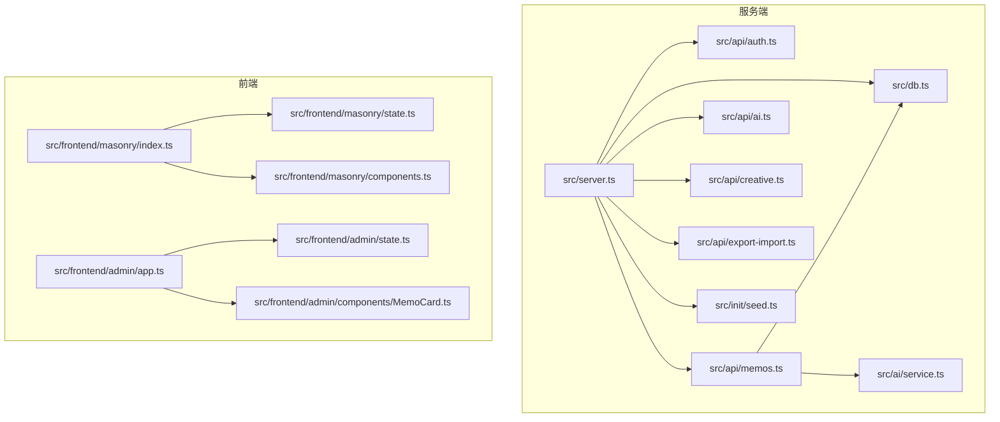
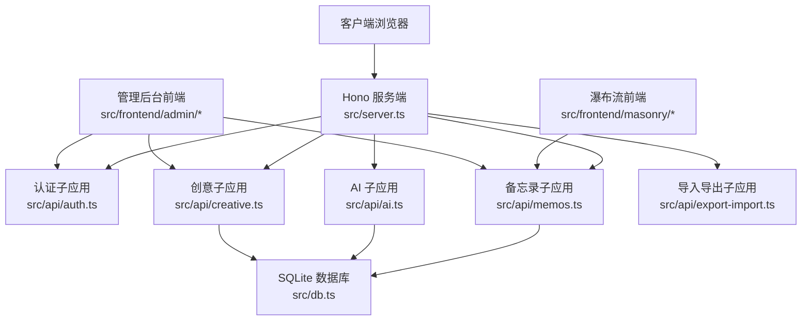
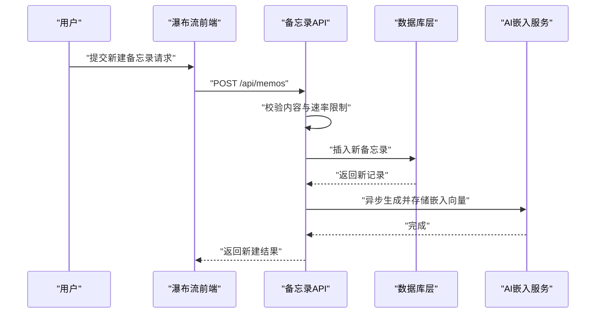
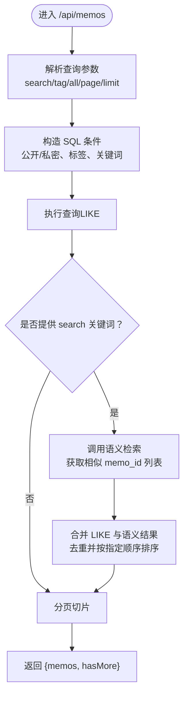
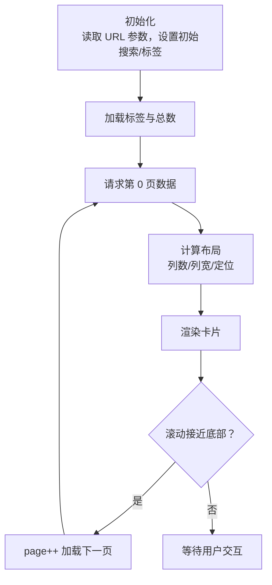
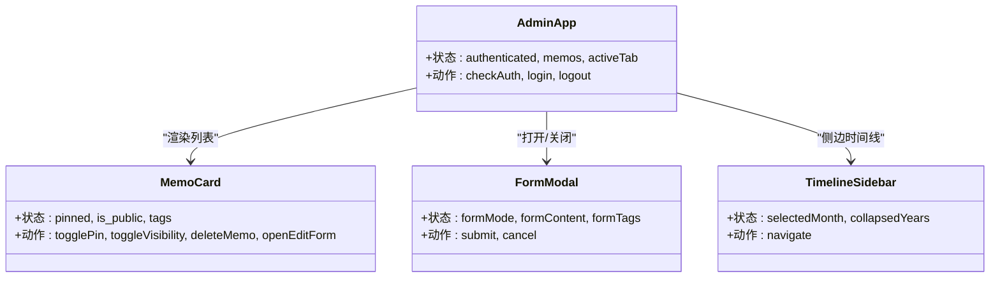
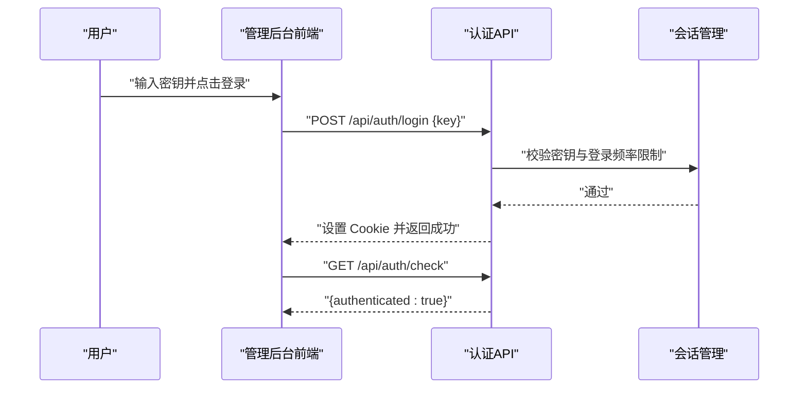
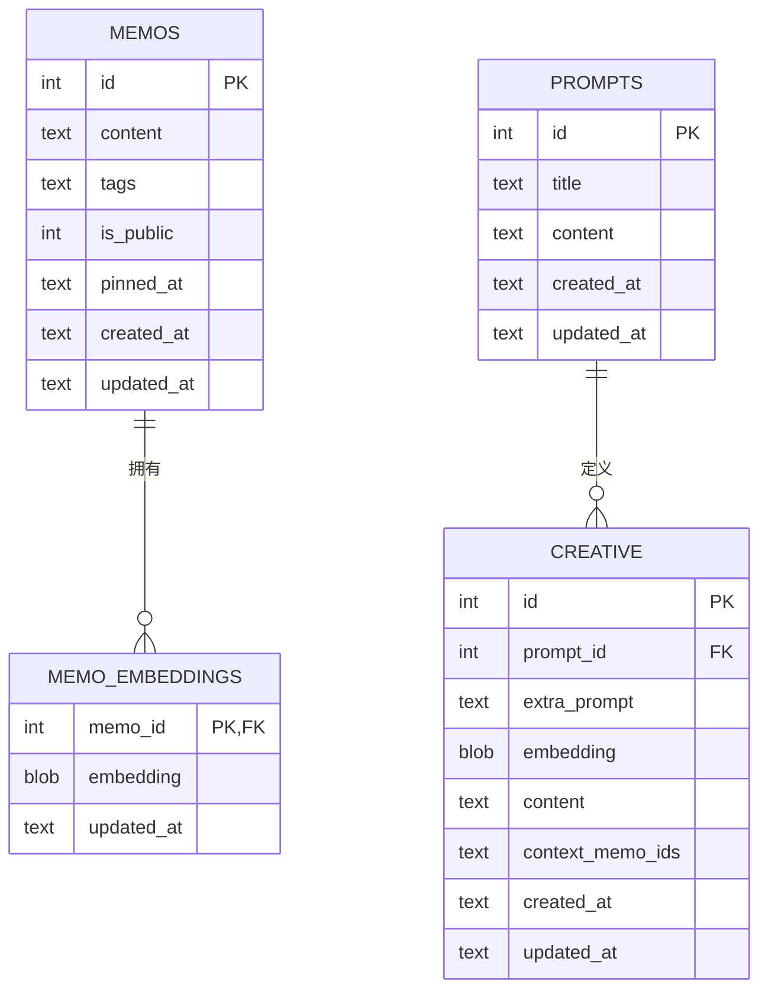
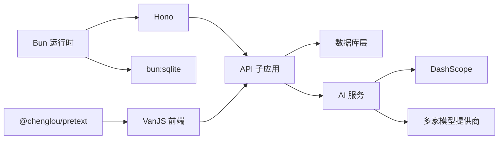

# 项目介绍

<cite>
**本文引用的文件**
- [README.md](file://README.md)
- [package.json](file://package.json)
- [src/server.ts](file://src/server.ts)
- [src/db.ts](file://src/db.ts)
- [src/model.ts](file://src/model.ts)
- [src/api/memos.ts](file://src/api/memos.ts)
- [src/api/auth.ts](file://src/api/auth.ts)
- [src/frontend/masonry/index.ts](file://src/frontend/masonry/index.ts)
- [src/frontend/masonry/components.ts](file://src/frontend/masonry/components.ts)
- [src/frontend/masonry/state.ts](file://src/frontend/masonry/state.ts)
- [src/frontend/admin/app.ts](file://src/frontend/admin/app.ts)
- [src/frontend/admin/components/MemoCard.ts](file://src/frontend/admin/components/MemoCard.ts)
- [src/frontend/admin/state.ts](file://src/frontend/admin/state.ts)
- [src/init/seed.ts](file://src/init/seed.ts)
- [src/ai/service.ts](file://src/ai/service.ts)
</cite>

## 目录
1. [引言](#引言)
2. [项目结构](#项目结构)
3. [核心组件](#核心组件)
4. [架构总览](#架构总览)
5. [详细组件分析](#详细组件分析)
6. [依赖关系分析](#依赖关系分析)
7. [性能考量](#性能考量)
8. [故障排查指南](#故障排查指南)
9. [结论](#结论)
10. [附录](#附录)

## 引言
Memos 是一个基于 Bun 运行时构建的轻量级备忘录应用系统，专注于“小而美”的个人知识管理与内容创作。它通过内置的 SQLite 数据库、前后端分离的 SPA 界面、以及可选的 AI 辅助能力，为用户提供从日常记录到深度整理的一体化体验。

- 价值主张
  - 轻量无依赖：仅依赖 Bun 内置能力（SQLite + HTTP Server），无需额外数据库或容器。
  - 前后端分离：首页瀑布流与管理后台分别采用 VanJS 与 @chenglou/pretext，职责清晰、开发友好。
  - 易于部署：一次构建，即可在任意环境运行；支持生产模式与开发模式双形态。
  - 智能增强：可选的嵌入向量与重排序能力，结合外部模型，提供语义检索与相似内容发现。

- 目标用户
  - 个人知识管理者：需要结构化记录、检索与回顾的个人用户。
  - 内容创作者：需要灵感收集、草稿整理与风格改写的创作者。
  - 小团队/协作场景：通过公开/私密切换与标签体系，实现轻量协作与知识沉淀。

- 与传统备忘录应用的对比
  - 优势：一体化部署、前后端解耦、可扩展的 AI 能力、瀑布流展示与 URL 同步。
  - 劣势：当前仍聚焦基础功能，高级协作与权限模型有待进一步完善。

**章节来源**
- [README.md:1-186](file://README.md#L1-L186)

## 项目结构
项目采用“按层+按功能”混合组织方式：
- 顶层：README、package.json、配置文件与构建脚本
- src/
  - server.ts：HTTP 服务入口，路由分发、静态资源与页面托管
  - db.ts：SQLite 数据层封装，提供备忘录、标签、嵌入向量、提示词与创意内容的 CRUD
  - api/：后端 API 子应用（认证、备忘录、AI、创意、导入导出）
  - frontend/：前端 SPA（masonry 首页瀑布流、admin 管理后台）
  - init/seed.ts：首次启动的数据种子（内置提示词与示例备忘录）
  - ai/service.ts：AI 服务客户端（多提供商聊天、DashScope 嵌入与重排序）

**图示来源**
- [src/server.ts:1-125](file://src/server.ts#L1-L125)
- [src/db.ts:1-484](file://src/db.ts#L1-L484)
- [src/api/memos.ts:1-220](file://src/api/memos.ts#L1-L220)
- [src/api/auth.ts:1-77](file://src/api/auth.ts#L1-L77)
- [src/frontend/masonry/index.ts:1-23](file://src/frontend/masonry/index.ts#L1-L23)
- [src/frontend/masonry/state.ts:1-181](file://src/frontend/masonry/state.ts#L1-L181)
- [src/frontend/masonry/components.ts:1-337](file://src/frontend/masonry/components.ts#L1-L337)
- [src/frontend/admin/app.ts:1-251](file://src/frontend/admin/app.ts#L1-L251)
- [src/frontend/admin/state.ts:1-178](file://src/frontend/admin/state.ts#L1-L178)
- [src/frontend/admin/components/MemoCard.ts:1-346](file://src/frontend/admin/components/MemoCard.ts#L1-L346)
- [src/init/seed.ts:1-118](file://src/init/seed.ts#L1-L118)
- [src/ai/service.ts:1-507](file://src/ai/service.ts#L1-L507)

**章节来源**
- [README.md:25-45](file://README.md#L25-L45)
- [package.json:1-26](file://package.json#L1-L26)

## 核心组件
- 服务端入口与路由
  - 统一使用 Hono 挂载子应用，提供 /api/* 的 REST 接口与 /admin/* 的 SPA 页面托管
  - 静态资源与 favicon 支持，支持深层路由回退至 admin SPA
- 数据库层
  - SQLite（bun:sqlite，WAL 模式），提供 memos、memo_embeddings、prompts、creative 等表
  - 提供标签解析、全文检索、分页、计数、置顶、嵌入向量增删改查等能力
- API 子应用
  - 认证：基于 Cookie + 内存会话，密钥登录/登出，带登录频率限制
  - 备忘录：CRUD、标签、全文检索（LIKE + 语义检索融合）、分页、置顶
  - AI：多提供商聊天、DashScope 嵌入与重排序、创意内容生成与聊天工作区
  - 导入导出：支持按时间戳导入、导出全部创意内容
- 前端组件
  - 首页瀑布流：@chenglou/pretext 文本预排版，自适应列数、虚拟滚动、URL 同步
  - 管理后台：VanJS 响应式 UI，支持创建/编辑/删除、切换可见性、置顶、AI 工具箱、导入导出

**章节来源**
- [src/server.ts:38-125](file://src/server.ts#L38-L125)
- [src/db.ts:15-61](file://src/db.ts#L15-L61)
- [src/api/memos.ts:26-220](file://src/api/memos.ts#L26-L220)
- [src/api/auth.ts:29-77](file://src/api/auth.ts#L29-L77)
- [src/frontend/masonry/components.ts:283-337](file://src/frontend/masonry/components.ts#L283-L337)
- [src/frontend/admin/app.ts:48-251](file://src/frontend/admin/app.ts#L48-L251)

## 架构总览
Memos 采用“服务端统一入口 + 多子应用 API + 前端 SPA”的分层架构。服务端负责路由与静态资源，API 子应用处理业务逻辑，前端通过状态驱动渲染与交互。

**图示来源**
- [src/server.ts:38-125](file://src/server.ts#L38-L125)
- [src/api/auth.ts:29-77](file://src/api/auth.ts#L29-L77)
- [src/api/memos.ts:26-220](file://src/api/memos.ts#L26-L220)
- [src/db.ts:15-61](file://src/db.ts#L15-L61)
- [src/frontend/masonry/index.ts:1-23](file://src/frontend/masonry/index.ts#L1-L23)
- [src/frontend/admin/app.ts:1-251](file://src/frontend/admin/app.ts#L1-L251)

## 详细组件分析

### 备忘录管理（CRUD + 搜索 + 置顶）
- 功能要点
  - 创建/更新/删除：支持内容校验、标签清洗、可见性控制
  - 搜索：LIKE 全文匹配 + 语义检索融合，提升召回质量
  - 分页：支持页码与条数控制，避免一次性加载过多
  - 置顶：置顶字段与排序策略保证置顶内容优先展示
- 关键流程（创建备忘录）

**图示来源**
- [src/api/memos.ts:103-144](file://src/api/memos.ts#L103-L144)
- [src/db.ts:198-212](file://src/db.ts#L198-L212)
- [src/ai/service.ts:351-385](file://src/ai/service.ts#L351-L385)

**章节来源**
- [src/api/memos.ts:26-220](file://src/api/memos.ts#L26-L220)
- [src/db.ts:122-249](file://src/db.ts#L122-L249)

### 标签分类与全文搜索
- 标签
  - 存储为 JSON 数组，兼容旧格式字符串；查询时使用 json_each 进行多标签匹配
  - 首页瀑布流提供标签下拉选择与 URL 同步
- 全文搜索
  - LIKE 匹配 content 字段，支持搜索关键词与标签组合过滤
  - 语义检索融合：当存在搜索词时，先进行语义相似度检索，再与 LIKE 结果合并去重
- 瀑布流布局
  - 基于 @chenglou/pretext 文本预排版，计算卡片高度，实现精确的 Masonry 布局
  - 自适应列数、虚拟滚动、无限滚动加载

**图示来源**
- [src/api/memos.ts:28-70](file://src/api/memos.ts#L28-L70)
- [src/db.ts:122-169](file://src/db.ts#L122-L169)

**章节来源**
- [src/frontend/masonry/components.ts:65-121](file://src/frontend/masonry/components.ts#L65-L121)
- [src/frontend/masonry/state.ts:84-152](file://src/frontend/masonry/state.ts#L84-L152)

### 瀑布流展示（Masonry）
- 布局算法
  - 根据窗口宽度计算列数与列宽，使用贪心策略分配最短列
  - 预排版文本高度，叠加卡片内边距、按钮区高度与置顶徽标高度
- 交互与性能
  - 虚拟滚动：只渲染可视区域卡片，滚动时动态回收/创建 DOM
  - URL 同步：搜索与标签状态同步到 URL 参数，支持前进/后退与书签
  - 无限滚动：接近底部自动加载下一页

**图示来源**
- [src/frontend/masonry/index.ts:6-23](file://src/frontend/masonry/index.ts#L6-L23)
- [src/frontend/masonry/components.ts:283-337](file://src/frontend/masonry/components.ts#L283-L337)
- [src/frontend/masonry/state.ts:84-152](file://src/frontend/masonry/state.ts#L84-L152)

**章节来源**
- [src/frontend/masonry/index.ts:1-23](file://src/frontend/masonry/index.ts#L1-L23)
- [src/frontend/masonry/components.ts:1-337](file://src/frontend/masonry/components.ts#L1-L337)
- [src/frontend/masonry/state.ts:1-181](file://src/frontend/masonry/state.ts#L1-L181)

### 管理后台（VanJS SPA）
- 功能概览
  - 登录/登出：密钥认证，Cookie 管理
  - 备忘录管理：创建、编辑、删除、切换可见性、置顶、AI 工具箱
  - 创意内容：提示词管理、创意生成、聊天工作区、导入导出
  - 统计与导航：统计总数与字数、标签与时间线导航
- 组件关系

**图示来源**
- [src/frontend/admin/app.ts:48-251](file://src/frontend/admin/app.ts#L48-L251)
- [src/frontend/admin/components/MemoCard.ts:61-346](file://src/frontend/admin/components/MemoCard.ts#L61-L346)
- [src/frontend/admin/state.ts:37-178](file://src/frontend/admin/state.ts#L37-L178)

**章节来源**
- [src/frontend/admin/app.ts:1-251](file://src/frontend/admin/app.ts#L1-L251)
- [src/frontend/admin/components/MemoCard.ts:1-346](file://src/frontend/admin/components/MemoCard.ts#L1-L346)
- [src/frontend/admin/state.ts:1-178](file://src/frontend/admin/state.ts#L1-L178)

### 认证与安全
- 密钥登录：/api/auth/login，校验密钥并下发 Cookie
- 登出：/api/auth/logout，销毁会话并清理 Cookie
- 登录频率限制：防暴力破解
- 会话状态：/api/auth/check，用于前端判断登录态

**图示来源**
- [src/api/auth.ts:31-77](file://src/api/auth.ts#L31-L77)
- [src/frontend/admin/app.ts:224-236](file://src/frontend/admin/app.ts#L224-L236)

**章节来源**
- [src/api/auth.ts:1-77](file://src/api/auth.ts#L1-L77)

### 数据模型与数据库设计
- 数据模型
  - Memo：id、content、tags、is_public、pinned_at、created_at、updated_at
  - Prompt：id、title、content、created_at、updated_at
  - CreativeItem：id、prompt_id、extra_prompt、embedding、content、context_memo_ids、created_at、updated_at
  - MemoEmbedding：memo_id、embedding、updated_at
- 关键约束
  - memos.tags 使用 JSON 数组存储，兼容旧字符串标签
  - memo_embeddings 外键关联 memos(id)，删除时级联
  - prompts 与 creative 的外键关联，保证数据一致性

**图示来源**
- [src/model.ts:1-35](file://src/model.ts#L1-L35)
- [src/db.ts:18-60](file://src/db.ts#L18-L60)

**章节来源**
- [src/model.ts:1-35](file://src/model.ts#L1-L35)
- [src/db.ts:15-61](file://src/db.ts#L15-L61)

### 种子数据与首次启动
- 种子数据
  - 若 prompts 表为空，批量导入 data/prompts 下的 txt 文件作为内置提示词
  - 若 memos 表为空，导入 data/memos.txt 中的示例内容
- 作用
  - 降低上手门槛，提供开箱即用的示例与提示词

**章节来源**
- [src/init/seed.ts:16-118](file://src/init/seed.ts#L16-L118)

## 依赖关系分析
- 运行时与构建
  - Bun：运行时、HTTP 服务器、SQLite、构建（Bun.build）
  - TypeScript：类型检查与编译
- 前端框架
  - VanJS：管理后台 SPA
  - @chenglou/pretext：瀑布流文本预排版
- 第三方集成
  - Hono：Web 框架与路由
  - DashScope：嵌入向量与重排序
  - 多家大模型提供商：OpenAI 兼容接口

**图示来源**
- [package.json:19-25](file://package.json#L19-L25)
- [src/ai/service.ts:43-71](file://src/ai/service.ts#L43-L71)

**章节来源**
- [package.json:1-26](file://package.json#L1-L26)
- [src/ai/service.ts:1-507](file://src/ai/service.ts#L1-L507)

## 性能考量
- 前端瀑布流
  - 预排版与布局缓存：减少重复计算
  - 虚拟滚动与无限滚动：控制 DOM 节点数量，降低内存占用
  - URL 同步：避免重复请求，提升可访问性
- 服务端
  - SQLite WAL 模式：提升并发读写性能
  - 语义检索融合：在搜索词存在时异步生成嵌入并合并结果，兼顾准确性与延迟
  - 速率限制：对创建与登录进行限流，防止滥用
- 数据库
  - 索引：pinned_at 字段索引，优化置顶排序
  - JSON 查询：使用 json_each 支持多标签匹配

**章节来源**
- [src/frontend/masonry/state.ts:61-152](file://src/frontend/masonry/state.ts#L61-L152)
- [src/db.ts:29-38](file://src/db.ts#L29-L38)
- [src/api/memos.ts:120-124](file://src/api/memos.ts#L120-L124)
- [src/api/auth.ts:41-50](file://src/api/auth.ts#L41-L50)

## 故障排查指南
- 无法访问管理后台
  - 检查密钥是否正确，确认已设置 MEMOS_SECRET_KEY（生产环境必须）
  - 查看登录频率限制是否触发
- 备忘录创建失败
  - 确认内容非空且 JSON 正确
  - 检查速率限制是否触发
- 语义搜索无结果
  - 确认 DashScope API Key 是否配置
  - 检查网络连通性与超时设置
- 首次启动无示例数据
  - 确认 data/prompts 与 data/memos.txt 是否存在
  - 查看控制台日志中的种子导入信息

**章节来源**
- [src/api/auth.ts:14-27](file://src/api/auth.ts#L14-L27)
- [src/api/memos.ts:103-144](file://src/api/memos.ts#L103-L144)
- [src/ai/service.ts:98-115](file://src/ai/service.ts#L98-L115)
- [src/init/seed.ts:16-118](file://src/init/seed.ts#L16-L118)

## 结论
Memos 以“轻量、易用、可扩展”为核心理念，通过 Bun 的原生能力与前后端分离的设计，为个人与小团队提供了从记录到整理再到创作的全链路工具。其瀑布流展示与管理后台的直观交互，配合可选的 AI 能力，使得知识管理既高效又富有创造性。对于希望快速搭建私有知识库或内容创作平台的用户而言，Memos 是一个值得考虑的方案。

## 附录
- 快速开始
  - 安装依赖：bun install
  - 启动服务：bun run dev 或 bun run start
  - 访问地址：首页 http://localhost:3020，管理后台 http://localhost:3020/admin
- 环境变量
  - PORT：服务器端口，默认 3020
  - MEMOS_SECRET_KEY：管理后台登录密钥（生产环境必须设置）

**章节来源**
- [README.md:47-87](file://README.md#L47-L87)
- [README.md:59-65](file://README.md#L59-L65)