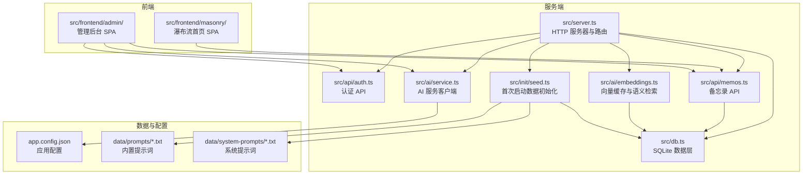
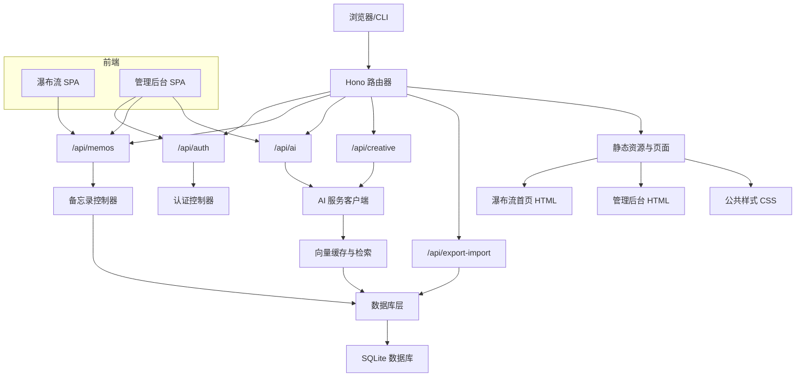
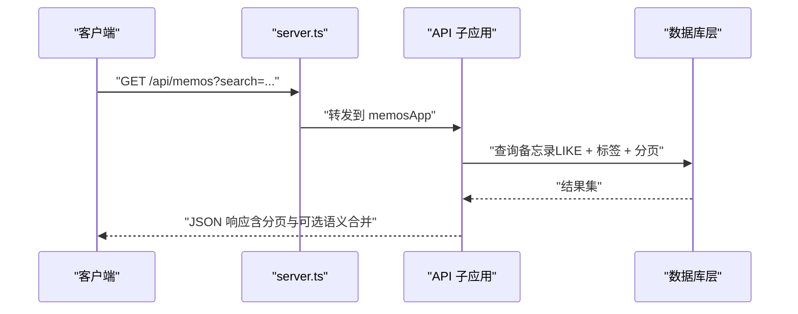
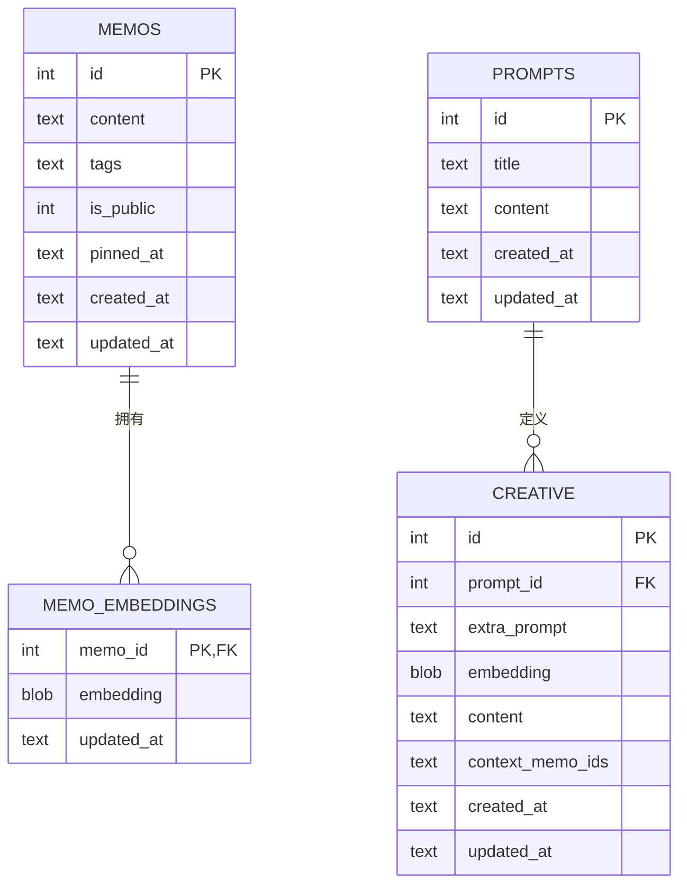
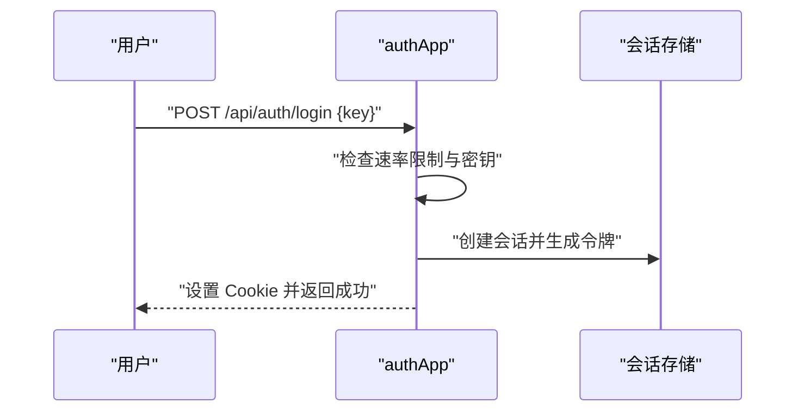
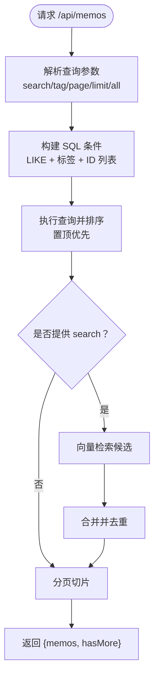
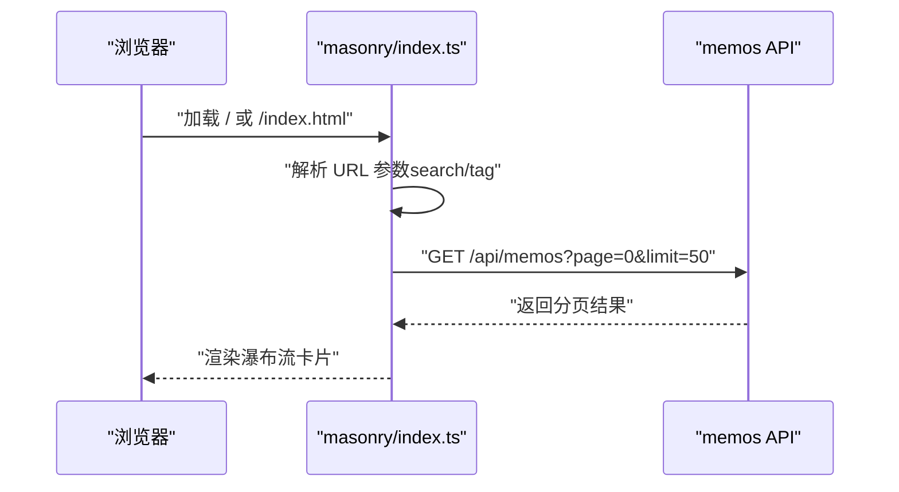
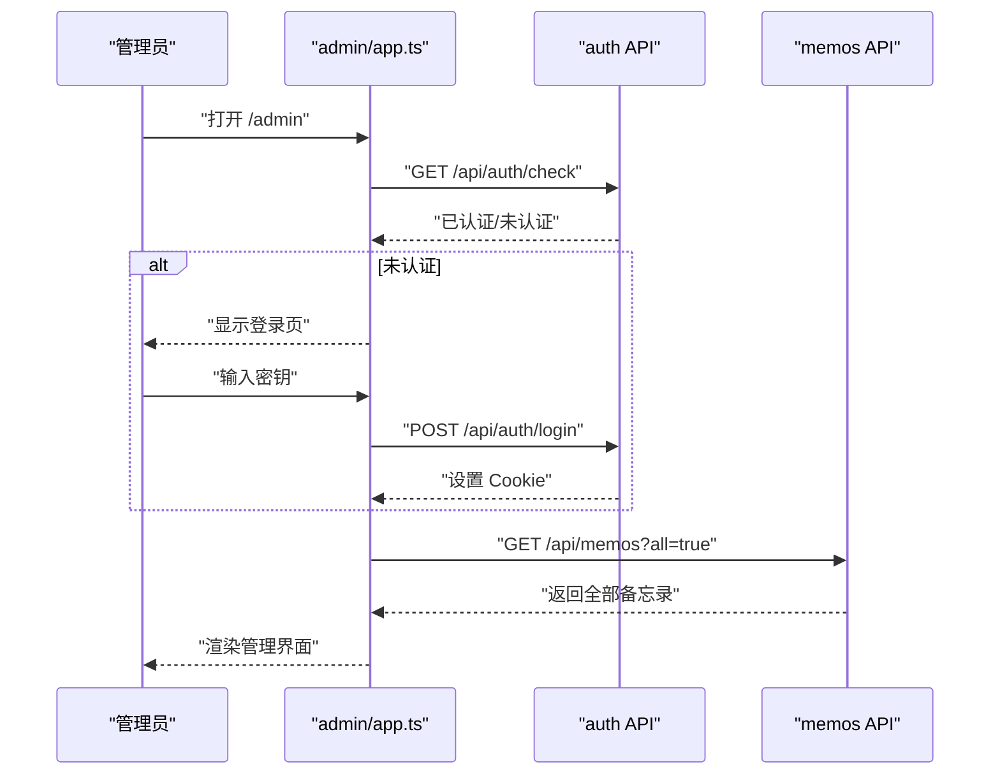
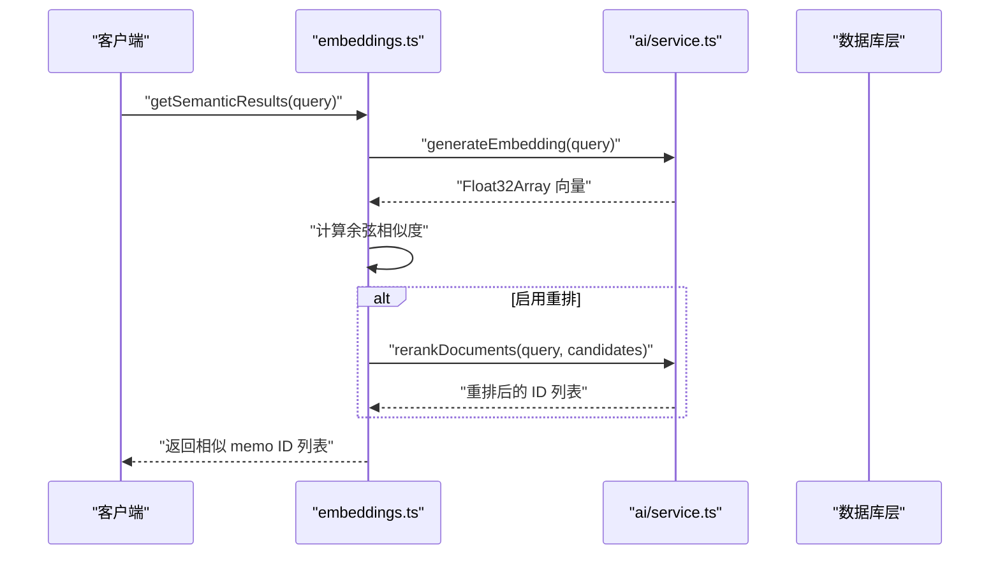
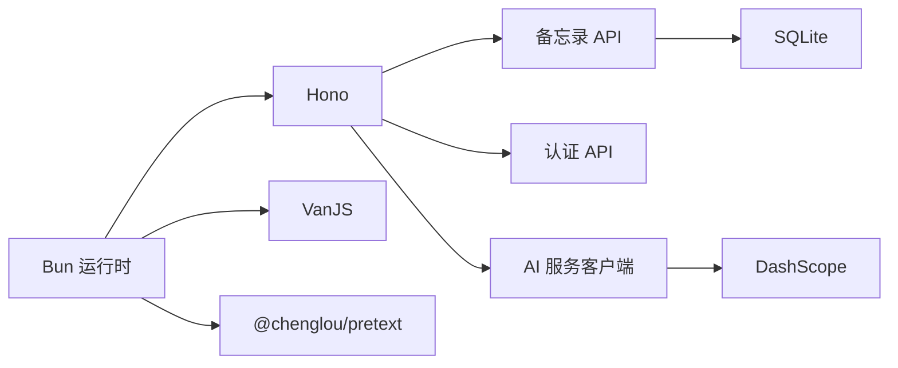

# 项目概述

<cite>
**本文引用的文件**
- [README.md](file://README.md)
- [package.json](file://package.json)
- [src/server.ts](file://src/server.ts)
- [src/db.ts](file://src/db.ts)
- [src/model.ts](file://src/model.ts)
- [src/api/memos.ts](file://src/api/memos.ts)
- [src/api/auth.ts](file://src/api/auth.ts)
- [src/frontend/masonry/index.ts](file://src/frontend/masonry/index.ts)
- [src/frontend/admin/app.ts](file://src/frontend/admin/app.ts)
- [src/ai/service.ts](file://src/ai/service.ts)
- [src/ai/embeddings.ts](file://src/ai/embeddings.ts)
- [src/init/seed.ts](file://src/init/seed.ts)
- [app.config.json](file://app.config.json)
- [data/system-prompts/creative.txt](file://data/system-prompts/creative.txt)
- [data/prompts/创意写作.txt](file://data/prompts/创意写作.txt)
</cite>

## 目录
1. [简介](#简介)
2. [项目结构](#项目结构)
3. [核心组件](#核心组件)
4. [架构总览](#架构总览)
5. [详细组件分析](#详细组件分析)
6. [依赖关系分析](#依赖关系分析)
7. [性能考量](#性能考量)
8. [故障排查指南](#故障排查指南)
9. [结论](#结论)
10. [附录](#附录)

## 简介
Memmos 是一个基于 Bun 运行时构建的轻量级备忘录应用系统，强调“小而美”的设计哲学：零外部依赖、开箱即用、易于部署与扩展。它提供公开/私密备忘录管理、标签分类、全文搜索、瀑布流展示与独立的管理后台等核心能力；同时内置 AI 能力（内容优化、标签建议、语义检索、创意写作等），并支持导入/导出。

- 产品定位：个人知识管理与创意写作辅助工具
- 目标用户：创作者、学生、研究人员、知识工作者
- 差异化优势：
  - 极简架构：Bun + SQLite，无需额外服务
  - 即时可用：首次启动自动初始化数据库与示例数据
  - 语义增强：内嵌向量检索与重排，提升搜索体验
  - 前后端分离：首页瀑布流与管理后台 SPA 独立开发与部署
  - 易于定制：配置驱动的 AI 提供商与模型选择

**章节来源**
- [README.md:1-186](file://README.md#L1-L186)

## 项目结构
项目采用“按功能域划分”的目录组织方式，核心分为服务端（API、数据库、认证、AI）、前端（瀑布流首页、管理后台 SPA）、数据与配置等部分。

**图示来源**
- [src/server.ts:1-125](file://src/server.ts#L1-L125)
- [src/db.ts:1-479](file://src/db.ts#L1-L479)
- [src/api/memos.ts:1-220](file://src/api/memos.ts#L1-L220)
- [src/api/auth.ts:1-77](file://src/api/auth.ts#L1-L77)
- [src/ai/embeddings.ts:1-228](file://src/ai/embeddings.ts#L1-L228)
- [src/ai/service.ts:1-507](file://src/ai/service.ts#L1-L507)
- [src/init/seed.ts:1-118](file://src/init/seed.ts#L1-L118)
- [app.config.json:1-22](file://app.config.json#L1-L22)
- [data/prompts/创意写作.txt:1-15](file://data/prompts/创意写作.txt#L1-L15)
- [data/system-prompts/creative.txt:1-2](file://data/system-prompts/creative.txt#L1-L2)

**章节来源**
- [README.md:25-46](file://README.md#L25-L46)
- [package.json:1-26](file://package.json#L1-L26)

## 核心组件
- 服务端入口与路由
  - 使用 Hono 搭建 API 路由，挂载认证、备忘录、AI、创意、导入导出子应用
  - 提供静态页面与资源分发（首页 HTML、管理后台 HTML、CSS、构建产物）
  - 首次启动初始化数据库、种子数据与向量缓存
- 数据层（SQLite）
  - 表结构：memos、memo_embeddings、prompts、creative
  - 支持标签数组存储、置顶字段、全文检索、向量检索与重排
- 认证与会话
  - 基于 Cookie + 内存会话的密钥认证，支持登录/登出/状态检查
- 备忘录 API
  - CRUD、标签查询、计数、相似度检索、分页、速率限制
- 瀑布流首页
  - 基于 VanJS 的 SPA，支持搜索栏、标签筛选、URL 同步、分页加载
- 管理后台
  - 独立 SPA，提供创建/编辑/删除、切换可见性、导入导出、AI 工具箱等功能
- AI 能力
  - 多提供商聊天兼容接口、DashScope 向量与重排、内容优化/标签建议/创意写作等

**章节来源**
- [src/server.ts:1-125](file://src/server.ts#L1-L125)
- [src/db.ts:1-479](file://src/db.ts#L1-L479)
- [src/api/memos.ts:1-220](file://src/api/memos.ts#L1-L220)
- [src/api/auth.ts:1-77](file://src/api/auth.ts#L1-L77)
- [src/frontend/masonry/index.ts:1-23](file://src/frontend/masonry/index.ts#L1-L23)
- [src/frontend/admin/app.ts:1-251](file://src/frontend/admin/app.ts#L1-L251)
- [src/ai/service.ts:1-507](file://src/ai/service.ts#L1-L507)
- [src/ai/embeddings.ts:1-228](file://src/ai/embeddings.ts#L1-L228)

## 架构总览
Memmos 采用前后端分离的单体式架构：服务端负责 API、静态资源与页面模板，前端分别提供瀑布流首页与管理后台 SPA。数据库采用 SQLite（WAL 模式），配合 Bun 的内置 SQLite 扩展，实现高性能与低耦合。

**图示来源**
- [src/server.ts:38-125](file://src/server.ts#L38-L125)
- [src/api/memos.ts:26-220](file://src/api/memos.ts#L26-L220)
- [src/api/auth.ts:29-77](file://src/api/auth.ts#L29-L77)
- [src/ai/service.ts:43-75](file://src/ai/service.ts#L43-L75)
- [src/ai/embeddings.ts:16-64](file://src/ai/embeddings.ts#L16-L64)
- [src/db.ts:15-61](file://src/db.ts#L15-L61)

## 详细组件分析

### 服务端入口与路由（src/server.ts）
- 路由组织
  - API 子应用挂载：/api/auth、/api/memos、/api/ai、/api/creative、/api/export-import
  - 页面路由：/、/index.html、/admin、/admin/index.html
  - 静态资源：favicon、构建产物、共享样式
- 生命周期
  - 初始化数据库、种子数据、向量缓存
  - 启动 HTTP 服务（Bun.serve）

**图示来源**
- [src/server.ts:38-125](file://src/server.ts#L38-L125)
- [src/api/memos.ts:28-70](file://src/api/memos.ts#L28-L70)
- [src/db.ts:122-164](file://src/db.ts#L122-L164)

**章节来源**
- [src/server.ts:1-125](file://src/server.ts#L1-L125)

### 数据层（src/db.ts 与 src/model.ts）
- 数据模型
  - Memo：id、content、tags（字符串数组）、is_public、pinned_at、created_at、updated_at
  - Prompt：id、title、content、created_at、updated_at
  - CreativeItem：id、prompt_id、extra_prompt、embedding、content、context_memo_ids、created_at、updated_at
  - MemoEmbedding：memo_id、embedding、updated_at
- 关键能力
  - 备忘录查询（支持搜索、标签、ID 列表、排序）
  - 标签聚合与去重
  - 嵌入向量的增删改查
  - 导入/导出辅助（保留时间戳）
  - 种子数据校验与去重

**图示来源**
- [src/db.ts:18-61](file://src/db.ts#L18-L61)
- [src/model.ts:1-35](file://src/model.ts#L1-L35)

**章节来源**
- [src/db.ts:1-479](file://src/db.ts#L1-L479)
- [src/model.ts:1-35](file://src/model.ts#L1-L35)

### 认证与会话（src/api/auth.ts）
- 密钥认证流程
  - 登录：校验密钥，记录登录尝试，创建会话并设置 Cookie
  - 登出：销毁会话并清除 Cookie
  - 状态检查：判断是否已认证
- 安全与限流
  - 登录尝试速率限制
  - 生产环境必须设置密钥，否则拒绝启动

**图示来源**
- [src/api/auth.ts:36-77](file://src/api/auth.ts#L36-L77)

**章节来源**
- [src/api/auth.ts:1-77](file://src/api/auth.ts#L1-L77)

### 备忘录 API（src/api/memos.ts）
- 查询与搜索
  - 支持搜索参数（全文 LIKE）、标签筛选（逗号分隔多标签）、分页
  - 管理视角可查看私密备忘录
- 语义检索增强
  - 搜索时并发触发向量相似度检索，合并结果并保持顺序一致性
- 速率限制
  - 每 IP 每小时/每天上限，防止滥用
- 置顶与相似度
  - 支持置顶/取消置顶
  - 按相似度获取相关备忘录

**图示来源**
- [src/api/memos.ts:28-70](file://src/api/memos.ts#L28-L70)
- [src/ai/embeddings.ts:95-154](file://src/ai/embeddings.ts#L95-L154)

**章节来源**
- [src/api/memos.ts:1-220](file://src/api/memos.ts#L1-L220)

### 瀑布流首页（src/frontend/masonry/index.ts）
- 初始化
  - 从 URL 读取初始搜索与标签
  - 渲染根组件并加载标签、总数与数据
- 特性
  - 响应式列数、虚拟滚动、URL 同步、分页加载

**图示来源**
- [src/frontend/masonry/index.ts:1-23](file://src/frontend/masonry/index.ts#L1-L23)
- [src/api/memos.ts:28-70](file://src/api/memos.ts#L28-L70)

**章节来源**
- [src/frontend/masonry/index.ts:1-23](file://src/frontend/masonry/index.ts#L1-L23)

### 管理后台（src/frontend/admin/app.ts）
- 登录页与主界面
  - 密钥登录、状态检查、统计信息
- 功能区
  - 备忘录时间线与卡片、标签切换、导入导出、AI 工具箱
- 交互
  - 表单弹窗、侧边栏、Tab 切换、全局错误提示

**图示来源**
- [src/frontend/admin/app.ts:48-232](file://src/frontend/admin/app.ts#L48-L232)
- [src/api/auth.ts:31-34](file://src/api/auth.ts#L31-L34)
- [src/api/memos.ts:72-77](file://src/api/memos.ts#L72-L77)

**章节来源**
- [src/frontend/admin/app.ts:1-251](file://src/frontend/admin/app.ts#L1-L251)

### AI 能力（src/ai/service.ts 与 src/ai/embeddings.ts）
- 多提供商聊天兼容
  - 通过配置文件与环境变量选择提供商与模型
  - 支持流式与非流式对话
- 向量与重排
  - DashScope 文本嵌入生成
  - 基于余弦相似度的候选召回与 qwen3-rerank 重排
- 应用集成
  - 备忘录搜索增强、相似度检索、内容优化、标签建议、创意写作

**图示来源**
- [src/ai/embeddings.ts:95-154](file://src/ai/embeddings.ts#L95-L154)
- [src/ai/service.ts:351-385](file://src/ai/service.ts#L351-L385)
- [src/ai/service.ts:389-445](file://src/ai/service.ts#L389-L445)

**章节来源**
- [src/ai/service.ts:1-507](file://src/ai/service.ts#L1-L507)
- [src/ai/embeddings.ts:1-228](file://src/ai/embeddings.ts#L1-L228)

### 首次启动与种子数据（src/init/seed.ts）
- 行为
  - 若提示词表为空则批量导入 data/prompts 下的 .txt 文件
  - 若备忘录表为空则导入 data/memos.txt 中的示例条目
  - 防重复插入，日志记录导入结果
- 作用
  - 降低上手门槛，提供即用示例

**章节来源**
- [src/init/seed.ts:1-118](file://src/init/seed.ts#L1-L118)

## 依赖关系分析
- 运行时与框架
  - Bun：内置 HTTP 服务器、SQLite、构建工具
  - Hono：轻量 Web 框架
  - VanJS：前端响应式 UI 框架
  - @chenglou/pretext：文字排版与精确高度计算
- 外部服务
  - DashScope：文本嵌入与重排
  - 第三方大模型提供商：通过配置与环境变量接入
- 构建与打包
  - 服务端按需编译 TypeScript 为 JS
  - 前端分别构建瀑布流与管理后台的 ESM 包

**图示来源**
- [package.json:19-25](file://package.json#L19-L25)
- [src/ai/service.ts:43-75](file://src/ai/service.ts#L43-L75)
- [src/db.ts:1-13](file://src/db.ts#L1-L13)

**章节来源**
- [package.json:1-26](file://package.json#L1-L26)
- [README.md:14-24](file://README.md#L14-L24)

## 性能考量
- 数据库
  - WAL 模式提升并发读写性能
  - JSON 函数与索引优化标签查询与置顶排序
- 搜索
  - 全文 LIKE 与向量检索并行，语义候选再重排，兼顾速度与质量
- 前端
  - 瀑布流虚拟滚动减少 DOM 节点数量
  - 分页加载避免一次性渲染大量卡片
- 速率限制
  - 防止滥用，保护服务稳定性

**章节来源**
- [src/db.ts:9-13](file://src/db.ts#L9-L13)
- [src/api/memos.ts:37-54](file://src/api/memos.ts#L37-L54)
- [src/frontend/masonry/index.ts:1-23](file://src/frontend/masonry/index.ts#L1-L23)
- [src/api/memos.ts:120-124](file://src/api/memos.ts#L120-L124)

## 故障排查指南
- 无法启动或端口占用
  - 检查端口配置与进程占用
- 认证失败
  - 确认密钥一致；生产环境必须设置 MEMOS_SECRET_KEY
  - 查看登录尝试速率限制
- 搜索无结果
  - 确认已生成向量缓存；检查 DashScope API Key
  - 尝试简化搜索词或使用标签筛选
- 管理后台空白或加载失败
  - 检查 /admin 路由与静态资源路径
  - 确认 Cookie 已设置且未过期
- 导入/导出异常
  - 检查数据格式与时间戳
  - 确保提示词表存在（默认提示词在首次启动时生成）

**章节来源**
- [src/api/auth.ts:14-27](file://src/api/auth.ts#L14-L27)
- [src/ai/embeddings.ts:16-64](file://src/ai/embeddings.ts#L16-L64)
- [src/init/seed.ts:112-118](file://src/init/seed.ts#L112-L118)

## 结论
Memmos 以“轻量、易用、可扩展”为核心设计原则，结合 Bun 的高性能与 SQLite 的低复杂度，构建了从个人到团队均可快速落地的知识管理与创意写作平台。通过语义检索与 AI 工具箱，进一步提升了内容发现与创作效率；通过前后端分离与配置化设计，满足不同场景下的定制需求。

## 附录
- 快速开始
  - 安装依赖、启动服务、访问首页与管理后台
- 环境变量
  - PORT、MEMOS_SECRET_KEY
- 配置文件
  - app.config.json 控制 AI 请求超时、嵌入相似度阈值、重排策略、速率限制等

**章节来源**
- [README.md:47-87](file://README.md#L47-L87)
- [README.md:59-65](file://README.md#L59-L65)
- [app.config.json:1-22](file://app.config.json#L1-L22)